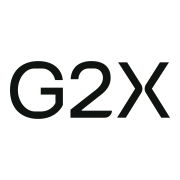

# G2X — GovCon MCP

Connect your agent to G2X GovCon intelligence and supported account workflows. This plugin includes a remote MCP connection and a short skill for using G2X.

## Install and connect

1. Install G2X from the Cursor Marketplace when the listing is available.
2. Complete the G2X OAuth sign-in flow presented by Cursor.
3. Confirm that G2X tools are listed, then try: “Find Leidos in G2X and return its company record link.”

A G2X account and network connection are required. Available capabilities depend on the tools, permissions, and plan exposed by your G2X connection. The plugin provides no offline data or standalone GovCon engine.

The server is `https://mcp.g2x.com/mcp`. Users do not supply client IDs, client secrets, API keys, or headers. See [Connect G2X](https://g2x.com/docs/connect), [G2X plans](https://g2x.com/pricing), and [support](https://g2x.com/support).

## Terminal access

The skill also supports the official [GovCon CLI](https://govcon.sh) when it is installed and the user requests terminal access. Use `govcon login` to sign in and `govcon --help` for supported commands. The plugin does not install the CLI or change its configuration. Both clients rely on authenticated G2X services.

## Local installation

Copy the complete plugin directory to `~/.cursor/plugins/local/g2x/`, then restart Cursor or run **Developer: Reload Window**. Local plugin imports must be allowed by your organization. In Customize, verify the `govcon-mcp` skill and G2X MCP server, complete sign-in, and run a read-only lookup.

## License

The files distributed in this plugin are licensed under MIT; see [LICENSE](LICENSE). This repository contains the client configuration and usage guidance for the hosted G2X service.
